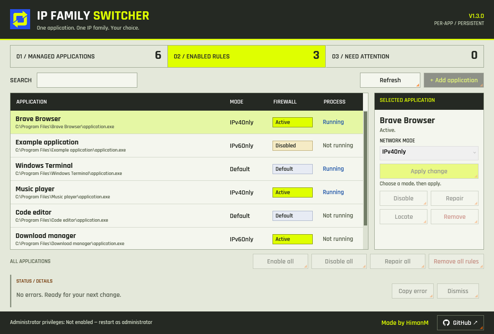
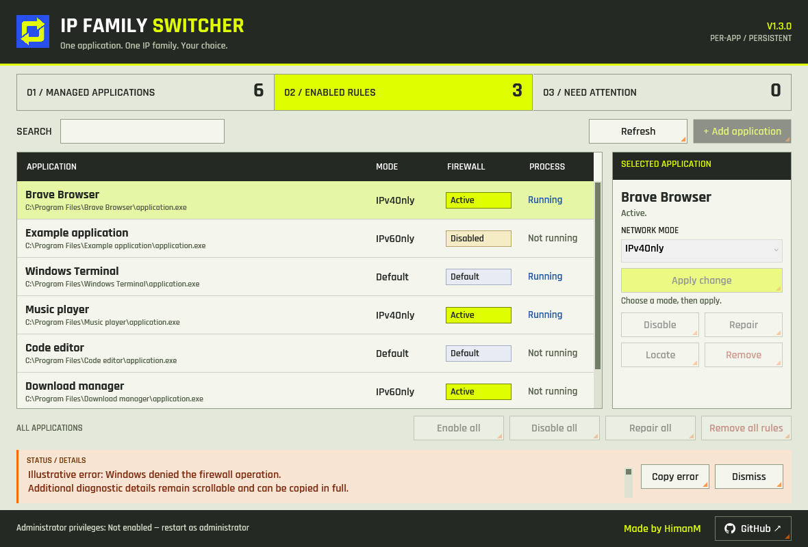

<p align="center"></p>
<h1 align="center">IP Family Switcher</h1>
<p align="center">Choose IPv4 or IPv6 per application. Keep Windows dual-stack.</p>
<p align="center"><a href="https://github.com/HimanM/IPFamilySwitcher/releases/latest">Download for Windows x64</a> · <a href="https://github.com/HimanM/IPFamilySwitcher/issues">Report an issue</a> · Made by <a href="https://github.com/HimanM">HimanM</a></p>


A small Windows desktop utility that installs persistent, executable-scoped Windows Defender Firewall rules. Built with C#, .NET 10, and WPF. No VPN, packet-capture driver, adapter changes, or global IP preference changes.



*Preview uses illustrative applications. Controls require administrator access.*

## Get started

1. Download `IPFamilySwitcher-Portable-x64-v1.3.0.zip` from [Releases](https://github.com/HimanM/IPFamilySwitcher/releases/latest) and extract it.
2. Run `IPFamilySwitcher.exe` and approve the administrator prompt.
3. Select **Add application**, then choose its `.exe`. It starts in **Default** mode.
4. Select an application row. In **Selected application**, choose **IPv4Only** or **IPv6Only**, then click **Apply change**.
5. Return to **Default** to remove that application's managed block.

Requires Windows 11 or Windows 10 22H2+, x64. Portable releases include the .NET runtime. Configuration is shared across portable copies, not stored beside the executable. Close an older copy before launching a new version.

## What the modes mean

| Mode | Effect |
|---|---|
| Default | No app-managed family block; Windows uses normal networking. |
| IPv4Only | Blocks outbound IPv6 for the chosen executable; leaves IPv4 available. |
| IPv6Only | Blocks outbound IPv4 for the chosen executable; leaves IPv6 available. |

Windows rejects zero-length prefixes through some firewall interfaces. This app uses `0::/1,8000::/1` for the full IPv6 space and `0.0.0.0-255.255.255.255` for the full IPv4 space. These are family-specific, not all-traffic blocks. Rules cover Domain, Private, and Public profiles.

A restriction applies to the selected executable path. Applications that delegate networking to a different helper executable need that helper configured separately. IPv6Only needs working IPv6 connectivity and IPv6-capable destinations.

## Read the status

**Firewall** and **Process** answer different questions:

| Indicator | Meaning |
|---|---|
| Active | The expected managed rule is present, enabled, and passes the app's property checks. |
| Disabled | The block is disabled; a configured family alone does not mean it is enforced. |
| Default | No managed family block is expected. |
| Missing / Incorrect rule / Duplicate | Review the rule; use Repair to recreate the configured restriction. |
| Executable missing | The stored path no longer exists; use Locate to update it. |
| Running | A process with the same full executable path is running, including background processes. |
| Not running | No matching running process was found. |
| Unavailable | Process inspection was denied; the app does not assume it is stopped. |

Hover over a firewall status for details. **Enabled rules** counts enabled rules, not running applications. Process inspection runs every five seconds while the window is visible and pauses when minimized. It never installs or removes firewall rules. “Active” validates rule configuration; it is not a live traffic test or a guarantee that another security product permits the connection.

Select a row to use **Enable / Disable**, **Repair**, **Locate**, or **Remove** in the shared right-hand panel. Buttons in this panel always target the selected application. Mode edits require **Apply change**; changing selection discards unapplied edits. Adding an executable selects it automatically. A search that hides the selection clears the panel. Global actions below the table affect all configured applications, including those hidden by search. **Remove all rules** asks for confirmation, removes this tool's managed rules, and resets configured apps to Default. Closing the app leaves rules in place.

### Long errors stay contained

The error panel reserves a fixed height. Scroll within it, copy the full message, or dismiss it without moving the list or action controls.



## Ownership and local data

- Managed group: `IPFamilySwitcher.ManagedRules`.
- Stable rule names: `IPFamilySwitcher-{GUID}-BlockIPv6` / `-BlockIPv4`.
- Per-app changes use the managed group and application GUID. Rules are not selected merely because they reference the same executable.
- No firewall reset, antivirus changes, adapter changes, or automatic executable launches.
- Configuration: `%ProgramData%\IPFamilySwitcher\config.json`.
- Backup: `%ProgramData%\IPFamilySwitcher\config.json.bak`.
- Rolling logs: `%ProgramData%\IPFamilySwitcher\logs\`.

Startup and Refresh inspect configuration against installed rules. Repair is explicit. Logs can contain executable paths; review them before attaching them to a public issue. To stop using the utility, remove its managed rules in the app before deleting the portable files.

## Build and test

Install the .NET 10 SDK on Windows:

```powershell
dotnet test IPFamilySwitcher.Tests/IPFamilySwitcher.Tests.csproj --configuration Release
./scripts/publish.ps1
```

The publish script reads `version.json`, stamps the executable version, and produces:

```text
Release/v1.3.0/IPFamilySwitcher.exe
IPFamilySwitcher-Portable-x64-v1.3.0.zip
IPFamilySwitcher-Portable-x64-v1.3.0.zip.sha256
```

Tests cover naming, configuration serialization, reconciliation, Windows COM property validation, process-path matching, selected-action targets, selection contrast, equal button sizes and bounds, embedded fonts, long-error containment, and at least five visible rows at the default size. Tests use detached COM rules and do **not** install live firewall rules. Actual rule installation and network behavior need an elevated manual test.

Manual smoke test: add an executable, apply each family restriction, verify the opposite family is blocked, return to Default, close/reopen to check persistence, and confirm unrelated firewall rules remain unchanged.

## Releasing a version

`version.json` is the release metadata source:

```json
{
  "version": "1.3.0",
  "releaseNotes": ["Describe the user-visible changes here."]
}
```

Increase `version` and update `releaseNotes`, then push to `master` or `main`. The [GitHub Actions workflow](.github/workflows/release.yml) runs Windows tests, builds the self-contained x64 ZIP, and creates a `v<version>` tag and release with the JSON notes and SHA-256 checksum. Existing releases are not overwritten. Pull requests only test/build; they do not publish. You can also run the workflow manually.

The release job uses GitHub's built-in token with [`contents: write`](https://docs.github.com/en/actions/reference/workflows-and-actions/workflow-syntax#permissions); no personal access token is required. The same JSON is embedded in the application for its visible version label.

## Design

Charcoal, acid yellow, muted sage, and safety orange; hard borders, angular typography, and text-backed status colors. Compact 56-pixel rows fit at least five applications at the default size; selection stays dark-on-lime even when focus moves to the action panel. Shared action buttons have consistent dimensions and custom scrollbars use orange drag feedback. Rajdhani Bold and SemiBold are embedded locally from [Google Fonts](https://github.com/google/fonts/tree/main/ofl/rajdhani) under the included [SIL Open Font License](IPFamilySwitcher/Resources/Fonts/OFL.txt). Buttons provide hover, pressed, and keyboard-focus states. Error details use a fixed-height scrollable panel with Copy error and Dismiss controls, so long messages cannot expand the layout. Original app icon generated with the built-in image tool; prompt and asset notes are in [docs/icon.md](docs/icon.md). The GitHub button opens this repository in your default browser.

Made by **HimanM**.
